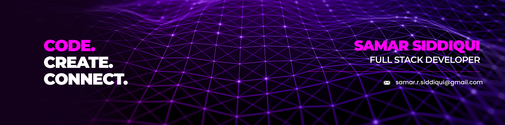

  
## About Me
Full Stack Developer with hands-on experience building scalable web applications across the entire stack. I design and develop performant frontends, architect secure backend services, and structure databases with long-term maintainability in mind.
My work focuses on delivering production-ready systems — not just features. I prioritize clean architecture, performance optimization, security best practices, and thoughtful user experience. I approach development with an engineering mindset: understand the problem deeply, design intentionally, and implement with precision.

 ## Engineering Philosophy 🌱
Strong fundamentals drive sustainable systems.
I continuously invest in strengthening core computer science principles — system design, networking, database architecture, caching strategies, and application security — while leveraging modern frameworks and tools where they add real value. Technology evolves quickly. Principles endure.

 ## Collaboration 🤝
Open to working on ambitious products, scalable systems, and technically challenging problems. I value clarity, ownership, and continuous improvement in every project I contribute to.

## 🌐 Socials:
    

# 💻 Tech Stack:
                               
# 📊 GitHub Stats:
 
 

### ✍️ Random Dev Quote

---
<!--  -->

<!-- Proudly created with GPRM ( https://gprm.itsvg.in ) -->
