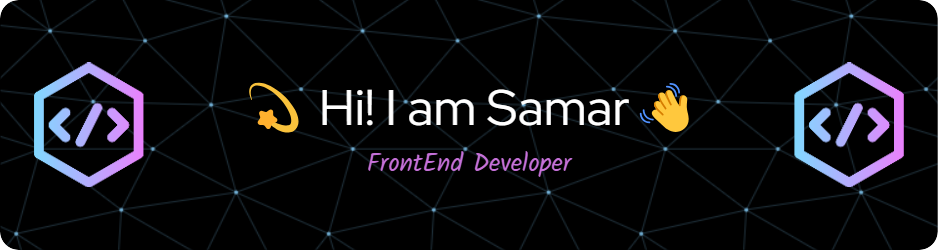

  
## About Me
 Welcome to my creative domain! I am a passionate Frontend Web Developer with a love for all things creative. My mission is to craft unique and inspiring digital spaces that leave a lasting impact.  I enjoy bringing a static design or idea to life and learning new technologies in the process.🎨💻

 ## 🌱 Embracing Growth
 In the dynamic world of web development, I'm a firm believer in the journey of continuous learning and adaptation. I prioritize dedicating time to exploring emerging technologies and delving into insightful tech blogs. This ongoing commitment to personal and professional growth ensures that I remain at the forefront of innovation, equipped with the latest knowledge and best practices to tackle any project head-on.

 ## 🤝 Let's Connect
I'm constantly seeking fresh challenges and thrilling projects to collaborate on. Whether you're envisioning a stunning website brought to life or searching for a dedicated developer to enhance your open-source endeavor, don't hesitate to get in touch.

## 🌐 Socials:
    

# 💻 Tech Stack:
      
# 📊 GitHub Stats:
 
 

### ✍️ Random Dev Quote

### 😂 Random Dev Meme

---

<!-- Proudly created with GPRM ( https://gprm.itsvg.in ) -->
